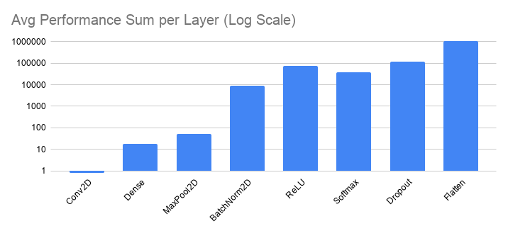

# MAIN EXCECUTION ENVIRONMENT

Component | Model 
:--|:--
CPU |  Ryzen 5 3400G
RAM |  2x8GB RAM 3200Mhz
GPU |  GTX 1660 6GB
STORAGE |  ~~nvme m.2 ssd gen3~~ \ HDD
OS  |  ~~Windows 10 pro~~ \ CachyOS

---

# DAILY SUMMARY

## DAY zero
* FORKED to `tgatcea-cmd` and cloned locally
* CREATED deepwiki of original repo at https://deepwiki.com/adcastel/miniOIA4DL
* EXECUTED `$ python main.py` and got a `ZeroDivisionError: float division by zero` error in the  `.\models\basemodel.py` file, line 22, in function definition `forward`: `images_per_second = imgs / layer_time`
* FIXED `layer_time`:`.\models\basemodel.py`(`forward` function) measurement by using `time.perf_time()` instead of `time.time()`
* EXECUTED `$ python main.py` succesfully: Total time: 73.95s IPS: 0.11images/sec
* MEASURED all available models with default configuration:

    | **Model** | **Excecution Time** | **Performance** | **Configuration** |
    |:---------:|:-------------------:|:---------------:|:-----------------:|
    | OIANet    | 70.17s              | 0.11 images/sec | default           |
    | TinyCNN   | 126.15s             | 0.06 images/sec | default           |
    | AlexNet   | 1103.71s            | 0.01 images/sec | default           |
    | ResNet18  | N/D                 | N/A             | epochs=1          |

* FIXED `resnet18_cifar_100.py` to include `training=False` parameter in function definition `forward(self, x, curr_iter=1)` after getting an unexpected keyword argument 'training' error in `$ python main.py --model ResNet18` execution
* CHANGED time all time measurements in `resnet18_cifar_100.py` to `time.perf_counter()` as prevention for rounding error (recommendation from inline copilot predictor when searching for `forward(self, x, curr_iter=1)` definition)

## DAY one
* EXECUTED and LOGGED `$ python main.py --model OIANet > ./logs/oianet_baseline.log` succesfully.
* ANALYZED 'oianet_baseline.log' and got a clear frontier on comparing layer performance (x62.79):
    * SLOWER LAYERS: Conv2D, Dense, MaxPool2D
    * FASTER LAYERS: BatchNorm2D, ReLU, Dropout, Softmax, Flatten
* EXECUTED and LOGGED `$ python main.py --model TinyCNN > ./logs/tinycnn_baseline.log` succesfully.
* ANALYZED 'tinycnn_baseline.log' and got a clear frontier on comparing layer performance (x9.43):
    * SLOWER LAYERS: Conv2D, Dense
    * FASTER LAYERS: BatchNorm2D, ReLU, Dropout, Softmax, Flatten
* STUDIED `_forward_direct` algorithm on `Conv2D` module.
* ADDED `_forward_im2col_GEMM` algorithm as `conv_algo 1` to `Conv2D` module following the `im2col+GEMM` aproach.
* EXECUTED and LOGGED `$ python main.py --model OIANet --conv_algo 1 > ./logs/oianet_(conv=1).log` succesfully.
* ANALYZED 'oianet_(conv=1).log' and got a clear frontier on comparing layer performance (x5.47):
    * SLOWER LAYERS: Dense, MaxPool2D
    * FASTER LAYERS: Conv2D, BatchNorm2D, ReLU, Dropout, Softmax, Flatten

### FIRST TARGET: **`avg. performance` average per layer >= 1000 imgs/sec** for OIANet

## LOST-MEDIA
Due to OS corruption I lost the Days 2 and 3 progress.
### DAY two
Primarely focused in Dense layer and Utils file.
### DAY three
Primarely focused in MaxPool2D layer.

## DAY four
Worked on retrieving as much as possible from previous progress.
* CREATED script `benchmark_script.py` to average execution results.
* BENCHMARKED `OIANet` as `BASELINE` (all naive) in `./logs/oianet_BASELINE_cachy.csv` with 10 executions.
* ANALYZED `./logs/oianet_BASELINE_cachy.csv` and got a clear frontier on comparing layers performance (x52.59):

    
    * SLOWER LAYERS (avg. perf. average < 1000 imgs/sec): Conv2D, Dense, MaxPool2D
    * FASTER LAYERS (avg. perf. average >= 1000 imgs/sec): BatchNorm2D, ReLU, Softmax, Dropout, Flatten
* BENCHMARKED `OIANet` as `conv_algo=1` in `./logs/oianet_(conv=1_others=naive)_cachy.csv` with 10 executions.
* ANALYZED `./logs/oianet_(conv=1_others=naive)_cachy.csv` and got a clear frontier on comparing layers performance (x6.14):

    .png)
    * SLOWER LAYERS: Dense, MaxPool2D, Conv2D
    * FASTER LAYERS: BatchNorm2D, ReLU, Softmax, Dropout, Flatten
* STUDIED `matmul_biasses` algorithm in `utils.py` used by `Dense` layer.
* ADDED `inline` aproach in the `matmul_biasses` algorithm in `utils.py`.
* BENCHMARKED `OIANet` as `conv_algo=1 dense=inline` in `./logs/oianet_(conv=1_dense=inline_others=naive)_cachy.csv` with 10 executions.
* ANALYZED `./logs/oianet_(conv=1_dense=inline_others=naive)_cachy.csv` and got a clear frontier on comparing layers performance (x6.14):
    
    .png)
    * SLOWER LAYERS: MaxPool2D, Conv2D
    * FASTER LAYERS: BatchNorm2D, Dense, ReLU, Softmax, Dropout, Flatten
* STUDIED `forward` algorithm in `MaxPool2D` layer.
* ADDED `vectorized` approach in `forward` algorithm in the `MaxPool2D` layer based on:
    * Nested loops bottleneck: naive looping suffers from data locality. Vectorization maximizes data locality for cache.
    * SIMD: numpy shifts excecution to compiled C-backend, offers performant SIMD micro-kernels
    * Mapping: sliding window approach creates a view from stride manipulation, avoiding main memory duplication and maximizing data locality.
* BENCHMARKED `OIANet` as `conv_algo=1 dense=inline maxpool2d=vectorizado` in `./logs/oianet_(conv=1_dense=inline_maxpool2d=vectorizado_others=naive)_cachy.csv` with 10 executions.
* ANALYZED `./logs/oianet_(conv=1_dense=inline_maxpool2d=vectorizado_others=naive)_cachy.csv` and got a clear frontier on comparing layers performance (x2.42):
    
    .png)
    * SLOWER LAYERS: Conv2D
    * FASTER LAYERS: BatchNorm2D, Dense, ReLU, Softmax, Dropout, Flatten
* DEEP STUDY of `Conv2D` layer

## DAY five & six
* SUMMARIZED days five, six and six+1/2.
* STUDIED theory on AI environment optimization from `S3` and `S4`.
* STUDIED from internet sources.
* APPLIED theoretical concepts of Cython tp code `Conv2D`, `Dense`, and `MaxPool2D` optimized variants.
* BENCHMARKING and TESTING: Memory Latency Bottleneck.
* TARGET: move execution towards Compute Bound.
        * CACHE BLOCKING: Partition into blocks fitting in cache. Avoids RAM fetches.
        * DATA PACKING: Copies data to contiguous buffers before micro-kernels. Enables efficient SIMD loads.
        * MICRO-KERNELS & SIMD: Loop unrolling for the innermost loop. Targets CPU vector registers to maximize FLOPS/cycle.
        * MULTITHREADING: OpenMP applied to outer loops (`prange`). Bypasses Python's GIL. Enables concurrent execution on multiple physical cores.
* BENCHMARKING and TESTING: Performance jumps from ~0.11 IPS (batch 8) to ~474 IPS (batch 176).
* MAIN ADDITIONS:
        * Benchmarking tools: `benchmark_suite.py`, `benchmark_script.py`.
        * Conv2D: `cython` approach.
        * MaxPool2D: `cython` approach.
        * Dense (matmul_biasses): `Blocking` approach.

---
# ARCHITECTURAL OVERHAUL SUMMARY
Performance optimizations applied sequentially to move the framework from **Memory Bound** (Python overhead + RAM latency) to **Compute Bound** (Hardware saturation).

Performance Trajectory (OIANet):
* **Day 0 (Baseline)**: 0.11 images/sec. Loop-bound in Python.
* **Day 4 (Vectorized)**: 120.85 images/sec. Efficient Numpy views + BLAS.
* **Day 6 (Cython Optimized)**: 474.2 images/sec. Low-level hardware affinity.

## Module-Level Documentation

### 1. Layer: `Conv2D` (conv2d.py, gemm.pyx, im2col.pyx)
Converts spatial convolutions into high-performance matrix operations.

* **Mode 0: Direct (Naive)**
    * *Mechanism*: 7-level nested loop. Scalar ops.
    * *Status*: Deprecated. Destroys Arithmetic Intensity.
* **Mode 1: IM2COL + GEMM (Python)**
    * *Mechanism*: Flattens patches via loops. 
    * *Status*: Suboptimal due to list reallocation overhead.
* **Mode 2: IM2COL Virtual (Vectorized)**
    * *Mechanism*: `as_strided` for $O(1)$ virtual tensor views.
    * *Theory*: Reuses BLAS via `@`. Maximizes Spatial Locality.
* **Mode 3: Cython GEMM (Optimized)**
    * *Mechanism*: Custom C-extension.
    * *Theory*: 
        * **Cache Blocking (Tiling)**: Partitions matrices into $mc \times kc$ blocks to fit in L2/L3 cache, reducing RAM fetches (S3).
        * **Data Packing**: Copies blocks into contiguous buffers ($Ac, Bc$) to enable unit-stride access and eliminate Cache Misses.
        * **Micro-kernels**: Innermost $mr \times nr$ loops unrolled to saturate CPU vector registers.
        * **OpenMP**: `prange` parallelism bypasses Python GIL for multi-core scaling.

### 2. Layer: `MaxPool2D` (maxpool2d.py, maxpool2d.pyx)
Downsampling and gradient routing.

* **Vectorized**: `sliding_window_view` + `np.max`. Leverages C-backend SIMD reductions.
* **Cython**: Direct C-access to memory pointers. Manual memory management avoids overhead of creating intermediate Numpy objects during pooling, crucial for low-latency inference.

### 3. Layer: `Dense` (dense.py, utils.py)
Linear mapping $Y = XW^T + b$.

* **Inline Approach**: `np.matmul(out=C)` prevents allocation of "ghost arrays".
* **Blocking Approach**: Implements manual tiling for the product. Improves Temporal Locality by reusing data already loaded into cache lines across multiple dot products.

---

### Implementation Directives
* **Hardware Affinity**: All optimizations target the Ryzen 5 3400G cache hierarchy (L1d: 32KB, L2: 512 KB, L3: 4 MB).